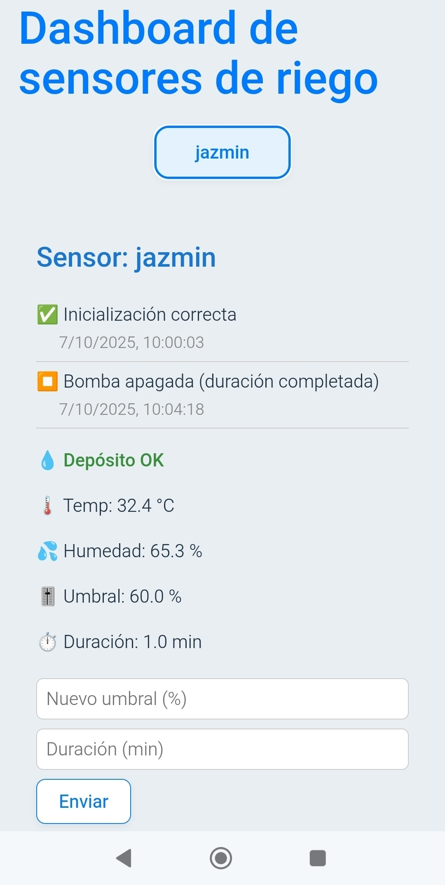

	

# Microlab Frontend

Una aplicación frontend moderna basada en React, diseñada para el monitoreo y control en tiempo real de microcontroladores con diversos sensores. Construida con Vite para un desarrollo rápido y rendimiento optimizado.

## Características

- Visualización de datos en tiempo real utilizando el protocolo MQTT
- Interfaz de usuario responsiva construida con React
- Soporte para múltiples dispositivos y sensores
- Integración con Mosquitto para la gestión de mensajes MQTT

## Aplicación en Vivo

Accede a la aplicación en vivo en: [microlab.cheroki.dev](https://microlab.cheroki.dev)

Para fines de prueba, utiliza las siguientes credenciales:

- **Usuario:** solo_lectura
- **Contraseña:** solo_lectura
